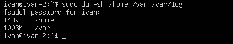

## Part 1. Установка ОС

**== Задание ==**

##### Установить **Ubuntu 20.04 Server LTS** без графического интерфейса. (Используем программу для виртуализации - VirtualBox)

- Графический интерфейс должен отсутствовать.

**== Выполнение ==**

- Узнайте версию Ubuntu, выполнив команду \
`cat /etc/issue.`
- Вставьте скриншот с выводом команды.

**== Выполнение ==**

## Part 2. Создание пользователя

**== Задание ==**

##### Создать пользователя, отличного от пользователя, который создавался при установке. Пользователь должен быть добавлен в группу `adm`.

- Вставьте скриншот вызова команды для создания пользователя.
- Новый пользователь должен быть в выводе команды \
`cat /etc/passwd`
- Вставьте скриншот с выводом команды.

**== Выполнение ==**

1. Добавлен пользователь "ivan"
`sudo adduser ivan`

2. Пользователь "ivan" добавлен в группу adm, но не удален из других групп (флаг -a)
`sudo usermod -aG adm ivan`

## Part 3. Настройка сети ОС

**== Задание ==**

##### Задать название машины вида user-1  

**== Выполнение ==**

1. Изменено название машины на marat-1 командами:
`sudo hostnamectl set-hostname marat-1`
`sudo reboot`

##### Установить временную зону, соответствующую вашему текущему местоположению.  

**== Выполнение ==**

1. Чтобы просмотреть текущую временную зону
`timedatectl`

2. Чтобы установить новую временную зону, использовал команду "sudo timedatectl set-timezone"
`sudo timedatectl set-timezone Europe/Moscow`

##### Вывести названия сетевых интерфейсов с помощью консольной команды.
- В отчёте дать объяснение наличию интерфейса lo.  

**== Выполнение ==**

1. Вывел названия сетевых интерфейсов с помощью команды
`ip link show`

- Также можно использовать `ifconfig -a`

Объяснение:
  - Интерфейс lo (Loopback) - это виртуальный сетевой интерфейс на компьютере, который используется для локальных сетевых операций, не требующих физического подключения к сети. Он представляет собой виртуальное соединение, которое работает только внутри самой машины и не имеет физического аппаратного оборудования. Lo (loopback device) – виртуальный интерфейс, присутствующий по умолчанию в любом Linux. Он используется для отладки сетевых программ и запуска серверных приложений на локальной машине.

  - Подробную информацию о интерфейсе lo посмотрим с помощью команды `ip addr show lo`

##### Используя консольную команду получить ip адрес устройства, на котором вы работаете, от DHCP сервера. 
- В отчёте дать расшифровку DHCP.  

**== Выполнение ==**

1. Чтобы запросить IP-адрес у DHCP сервера:
`sudo dhclient`

2. Чтобы просмотреть информацию о полученном IP-адресе:
`ip addr show`

   - DHCP (Dynamic Host Configuration Protocol) - это протокол сетевой конфигурации, который позволяет автоматически назначать IP-адреса, субнет-маски, шлюзы и другие параметры сети для устройств, подключенных к сети. DHCP упрощает управление сетевыми настройками и позволяет устройствам быстро подключаться к сети и получать необходимую конфигурацию.

##### Определить и вывести на экран внешний ip-адрес шлюза (ip) и внутренний IP-адрес шлюза, он же ip-адрес по умолчанию (gw). 

**== Выполнение ==**

1. Внешний IP-адрес шлюза:
`curl -s https://api64.ipify.org`. Другой способ: `$ curl ifconfig.co`

2. Внутренний IP-адрес:
`ip -br a show enp0s3`

##### Задать статичные (заданные вручную, а не полученные от DHCP сервера) настройки ip, gw, dns (использовать публичный DNS серверы, например 1.1.1.1 или 8.8.8.8).  

**== Выполнение ==**

1. Задание статического IP и шлюза (gw):

- Был изменен файл /etc/netplan/00-installer-config.yaml

##### Перезагрузить виртуальную машину. Убедиться, что статичные сетевые настройки (ip, gw, dns) соответствуют заданным в предыдущем пункте.  

**== Выполнение ==**

1. Перезагружаемся `sudo reboot`

- В отчёте опишите, что сделали для выполнения всех семи пунктов (можно как текстом, так и скриншотами).
- Успешно пропинговать удаленные хосты 1.1.1.1 и ya.ru и вставить в отчёт скрин с выводом команды. В выводе команды должна быть фраза "0% packet loss".

**== Выполнение ==**

1. Пингуем хост 1.1.1.1. Результат:

2. Пингуем хост ya.ru. Результат:

## Part 4. Обновление ОС

**== Задание ==**

##### Обновить системные пакеты до последней на момент выполнения задания версии.  

- После обновления системных пакетов, если ввести команду обновления повторно, должно появится сообщение, что обновления отсутствуют.
- Вставить скриншот с этим сообщением в отчёт.

**== Выполнение ==**

1. Команда `sudo apt-get update` используется для обновления списка доступных пакетов в системе на основе репозиториев, которые установлены на компьютере:

2. Затем используем команду `sudo apt-get upgrade` для обновления самих пакетов до последних версий

## Part 5. Использование команды **sudo**

**== Задание ==**

##### Разрешить пользователю, созданному в [Part 2](#part-2-создание-пользователя), выполнять команду sudo.

- В отчёте объяснить *истинное* назначение команды sudo (про то, что это слово - "волшебное", писать не стоит).  
- Поменять hostname ОС от имени пользователя, созданного в пункте [Part 2](#part-2-создание-пользователя) (используя sudo).
- Вставить скрин с изменённым hostname в отчёт.

**== Выполнение ==**

1. Команда `sudo` (Super User Do) используется в системах Unix и Linux для предоставления временных привилегий суперпользователя (root) обычным пользователям. Это позволяет выполнять команды с повышенными правами без необходимости постоянно входить в систему как суперпользователь.

2. Добавим ivan в sudo: `sudo usermod -aG sudo ivan`. Сменим пользователя `su ivan`, поменяем хостнейм `sudo hostnamectl set-hostname ivan-2`, перезагрузимся, чтобы изменения вступили в силу `sudo reboot`

## Part 6. Установка и настройка службы времени

**== Задание ==**

##### Настроить службу автоматической синхронизации времени.  

- Вывести время, часового пояса, в котором вы сейчас находитесь.
- Вывод следующей команды должен содержать `NTPSynchronized=yes`: \
  `timedatectl show`
- Вставить скрины с корректным временем и выводом команды в отчёт.

**== Выполнение ==**

1. Установил `sudo apt-get install systemd-timesyncd` и настроил systemd-timesyncd `sudo nano /etc/systemd/timesyncd.conf`:

## Part 7. Установка и использование текстовых редакторов 

**== Задание ==**

##### Установить текстовые редакторы **VIM** (+ любые два по желанию **NANO**, **MCEDIT**, **JOE** и т.д.)  
##### Используя каждый из трех выбранных редакторов, создайте файл *test_X.txt*, где X -- название редактора, в котором создан файл. Напишите в нём свой никнейм, закройте файл с сохранением изменений.  
- В отчёт вставьте скриншоты:
  - Из каждого редактора с содержимым файла перед закрытием.
- В отчёте укажите, что сделали для выхода с сохранением изменений.

**== Выполнение ==**

1. VIM. Нажал `Esc`, `:wq` и `Enter` для сохранения и выхода:

2. Nano. Нажал `Ctrl+X` (Exit), `Shift+Y` для сохранения и выхода:

3. McEdit. Создать файл `touch test_McEdit.txt`. Для открытия редактора ввел команду `mc`+`Enter`. Для редактирования файла `F4`, отредактировал и `F2` для сохранения, `F10` для выхода из редактора. 

##### Используя каждый из трех выбранных редакторов, откройте файл на редактирование, отредактируйте файл, заменив никнейм на строку "21 School 21", закройте файл без сохранения изменений.
- В отчёт вставьте скриншоты:
    - Из каждого редактора с содержимым файла после редактирования.
- В отчёте укажите, что сделали для выхода без сохранения изменений.

**== Выполнение ==**

1. VIM. Нажал `Esc`, `:q!` и `Enter` для выхода без сохранения:

2. Nano. Нажал `Ctrl+X` (Exit), `Shift+N` для выхода без сохранения:

3. McEdit. Для открытия редактора ввел команду `mc`+`Enter`. Для редактирования файла `F4`, отредактировал и `F10` и `No` для выхода из редактора без сохранения. 

##### Используя каждый из трех выбранных редакторов, отредактируйте файл ещё раз (по аналогии с предыдущим пунктом), а затем освойте функции поиска по содержимому файла (слово) и замены слова на любое другое.
- В отчёт вставьте скриншоты:
    - Из каждого редактора с результатами поиска слова.
    - Из каждого редактора с командами, введёнными для замены слова на другое.

**== Выполнение ==**

1. VIM. Нажал `Esc`, `/` и ввел слово для поиска. Нажал `Esc`, `:%s/СЛОВО ДЛЯ ЗАМЕНЫ/НОВОЕ СЛОВО/g` для замены.

2. Nano. Нажал `Ctrl+W`, ввел слово для поиска, `Enter`. Нажал `Ctrl+W` и `Ctrl+R`, ввел слово для поиска, `Enter`, ввел слово для замены, `Enter`.

3. McEdit. Для открытия редактора ввел команду `mc`+`Enter`. Для редактирования файла `F4`, для поиска `F7` и `F4` для поиска и замены. 

## Part 8. Установка и базовая настройка сервиса **SSHD**

**== Задание ==**

##### Установить службу SSHd.  

**== Выполнение ==**

1. Установка службы SSHd командой `sudo apt-get update` , `sudo apt-get install openssh-server`

##### Добавить автостарт службы при загрузке системы.  

**== Выполнение ==**

1. Добавление автостарта службы SSHd командой `sudo systemctl enable ssh`

##### Перенастроить службу SSHd на порт 2022.  

**== Выполнение ==**

1. С использованием редактора Nano `sudo nano /etc/ssh/sshd_config` отредактировал файл конфигурации SSHd для изменения порта. После изменения сохранил файл и перезапустил службу SSHd `sudo systemctl restart ssh`.

##### Используя команду ps, показать наличие процесса sshd. Для этого к команде нужно подобрать ключи.
- В отчёте объяснить значение команды и каждого ключа в ней.

**== Выполнение ==**

1. Для отображения процесса sshd с использованием команды ps, можно использовать ключ -C для указания имени процесса. В данном случае имя процесса - sshd.

2. Вот некоторые из ключей, которые можно использовать с командой ps:

- -a: Показывает процессы, связанные с терминалом (включая процессы других пользователей).
- -u <пользователь>: Показывает процессы, принадлежащие указанному пользователю.
- -e: Показывает все процессы, даже те, которые не связаны с текущим терминалом.
- -f: Выводит подробную информацию о процессах (полный формат).
- -l: Выводит расширенную информацию о процессах.
- -j: Выводит информацию о сессиях и группах процессов.
- -x: Показывает процессы, не связанные с терминалом.
- -C <имя_процесса>: Показывает процессы с указанным именем.
- -p <PID>: Показывает процесс с указанным идентификатором процесса (PID).
Их можно комбинировать.

##### Перезагрузить систему.
- В отчёте опишите, что сделали для выполнения всех пяти пунктов (можно как текстом, так и скриншотами).
- Вывод команды netstat -tan должен содержать  \
`tcp 0 0 0.0.0.0:2022 0.0.0.0:* LISTEN`  \
(если команды netstat нет, то ее нужно установить)
- Скрин с выводом команды вставить в отчёт.
- В отчёте объяснить значение ключей -tan, значение каждого столбца вывода, значение 0.0.0.0.

**== Выполнение ==**

1. Устанавливаем netstat `sudo apt-get update` и `sudo apt-get install net-tools`.

2. После перезагрузки системы `sudo reboot`, выполнил команду `netstat -tan | grep 2022` для проверки, что служба SSHd настроена на порт 2022.

   - -tan: Эти ключи означают, что нужно показать все TCP-порты (открытые сетевые соединения) в числовом формате (порты, IP-адреса и т.д.).
   Вывод содержит столбцы: Proto, Recv-Q, Send-Q, Local Address, Foreign Address, State.
   0.0.0.0: Этот адрес означает "любой адрес", что означает, что сервер слушает на всех сетевых интерфейсах.

    - p.s. В контексте сетевых служб, "слушание" означает ожидание входящих сетевых соединений на определенном сетевом порту. Когда сервер "слушает" определенный порт, это означает, что он прослушивает этот порт на наличие входящих запросов от других компьютеров. 

## Part 9. Установка и использование утилит **top**, **htop**

**== Задание ==**

##### Установить и запустить утилиты top и htop.  

- По выводу команды top определить и написать в отчёте:
  - uptime
  - количество авторизованных пользователей
  - общую загрузку системы
  - общее количество процессов
  - загрузку cpu
  - загрузку памяти
  - pid процесса занимающего больше всего памяти
  - pid процесса, занимающего больше всего процессорного времени
- В отчёт вставить скрин с выводом команды htop:
  - отсортированному по PID, PERCENT_CPU, PERCENT_MEM, TIME
  - отфильтрованному для процесса sshd
  - с процессом syslog, найденным, используя поиск 
  - с добавленным выводом hostname, clock и uptime  

**== Выполнение ==**

1. Команда `top`

uptime: Верхняя строка вывода top показывает, сколько времени прошло с момента последней перезагрузки системы (первая строка после "top").
-19 min

  Количество авторизованных пользователей: В верхней строке после "load average". 
  - 1 юзер
  
  Общая загрузка системы: В верхней строке после "load average". 
  - Первое значение (0.02): это средняя загрузка системы за последнюю 1 минуту.
  - Второе значение (0.04): это средняя загрузка системы за последние 5 минут.
  - Третье значение (0.07): это средняя загрузка системы за последние 15 минут.

  Общее количество процессов: Строка "Tasks".
  - 92 процесса
  
  Загрузка CPU: Графики под строкой "Cpu(s)".
  - 0.0 us,  0.0 sy, 0.0 ni, 99.7 id, 0.3 wa, 0.0 hi, 0.0 si, 0.0 st
      - us (User): Процент времени, в течение которого процессор занят выполнением пользовательских процессов (пользовательскими программами).

      - sy (System): Процент времени, в течение которого процессор занят выполнением системных задач ядра операционной системы.

      - ni (Nice): Процент времени, в течение которого процессор занят выполнением приоритетных пользовательских процессов (с более высоким "приоритетом").

      - id (Idle): Процент времени, в течение которого процессор не выполняет никаких задач и ожидает новых задач для выполнения. Это состояние свидетельствует о том, что процессор свободен.

      - wa (Wait): Процент времени, в течение которого процессор ожидает завершения операций ввода-вывода (I/O), таких как чтение или запись данных на диск.

      - hi (Hardware Interrupts): Процент времени, затрачиваемый на обработку аппаратных прерываний (например, от устройств ввода-вывода).

      - si (Software Interrupts): Процент времени, затрачиваемый на обработку программных прерываний, порождаемых ядром операционной системы.

      - st (Steal Time): Процент времени, когда процессор виртуализированной среды (например, виртуальной машины) был забран хост-системой.

  Загрузка памяти: Строка "MiB Mem".
      - total: Общее количество доступной физической памяти на системе.
      - used: Количество используемой физической памяти.
      - free: Количество свободной физической памяти.
      - shared: Количество памяти, разделяемой между процессами.
      - buff/cache: Количество памяти, используемой для буферов и кэша файловой системы.
      - available: Количество доступной памяти, которую можно выделить для новых процессов.
  Значения "MiB Mem" представлены в мебибайтах, которые являются бинарными единицами измерения (1024 байта).
  Информация в строке "MiB Mem" позволяет оценить, какая часть физической памяти используется, какая часть свободна, а также сколько памяти занято буферами и кэшем файловой системы.

  Столбцы:
  PID процесса, занимающего больше всего памяти: Вывод процессов, отсортированных по столбцу %MEM.
  PID процесса, занимающего больше всего процессорного времени: Вывод процессов, отсортированных по столбцу %CPU.

2. Команда `htop`. Скриншоты с информацией ниже:

      

## Part 10. Использование утилиты **fdisk**

**== Задание ==**

##### Запустить команду fdisk -l.

- В отчёте написать название жесткого диска, его размер и количество секторов, а также размер swap.

**== Выполнение ==**

1. Вывод команды `sudo fdisk -l`.
   

   - /dev/sda1 и /dev/sda2 - это названия жестких дисков. Размер и количество секторов в столбцах Sectors и Size.

1. В выводе команды fdisk -l нет строки со swap-разделом, т.к. нет созданного swap-раздела на текущем жестком диске.

## Part 11. Использование утилиты **df** 

**== Задание ==**

##### Запустить команду df.  
- В отчёте написать для корневого раздела (/):
  - размер раздела
  - размер занятого пространства
  - размер свободного пространства
  - процент использования
- Определить и написать в отчёт единицу измерения в выводе.  

##### Запустить команду df -Th.
- В отчёте написать для корневого раздела (/):
    - размер раздела
    - размер занятого пространства
    - размер свободного пространства
    - процент использования
- Определить и написать в отчёт тип файловой системы для раздела.

**== Выполнение ==**

1. Запуск команды df для корневого раздела `df -h /`

- Size 20G: Размер раздела
- Used 5.2G: Размер занятого пространства
- Avail 14G: Размер свободного пространства
- Use% 28%: Процент использования
- Единицы измерения в выводе: G (гигабайты) 

2. Запуск команды df -Th для корневого раздела 'df -Th /'

- Size 20G: Размер раздела
- Used 5.2G: Размер занятого пространства
- Avail 14G: Размер свободного пространства
- Use% 28%: Процент использования
- Единицы измерения в выводе: G (гигабайты) 
- Тип файловой системы для раздела: ext4.

## Part 12. Использование утилиты **du**

**== Задание ==**

##### Запустить команду du.
##### Вывести размер папок /home, /var, /var/log (в байтах, в человекочитаемом виде)
##### Вывести размер всего содержимого в /var/log (не общее, а каждого вложенного элемента, используя *)

- В отчёт вставить скрины с выводом всех использованных команд.

**== Выполнение ==**

1. Команда `du`

2. Команда `du -sh /home /var /var/log`

3. Запуск команды `du -sh /var/log*` для вывода размера всего содержимого в /var/log:

## Part 13. Установка и использование утилиты **ncdu**

**== Задание ==**

##### Установить утилиту ncdu.
##### Вывести размер папок /home, /var, /var/log.

- Размеры должны примерно совпадать с полученными в [Part 12](#part-12-использование-утилиты-du).

- В отчёт вставить скрины с выводом использованных команд.

**== Выполнение ==**

1. Установил утилиту ncdu с помощью команды `sudo apt-get install ncdu`.

2. Размеры папок
- Размер папки home вывел командой `ncdu /home`, размер совпадает.

- Размер папки var вывел командой `ncdu /var`, размер совпадает.

- Размер папки var/log вывел командой `ncdu /var/log`, размер совпадает.

## Part 14. Работа с системными журналами

**== Задание ==**

##### Открыть для просмотра:
##### 1. /var/log/dmesg
##### 2. /var/log/syslog
##### 3. /var/log/auth.log  

- Написать в отчёте время последней успешной авторизации, имя пользователя и метод входа в систему.
- Перезапустить службу SSHd.
- Вставить в отчёт скрин с сообщением о рестарте службы (искать в логах).

**== Выполнение ==**

1. Просмотр логов /var/log/dmesg утилитой Nano: `nano /var/log/dmesg`

2. Просмотр логов /var/log/syslog утилитой Nano: `nano /var/log/syslog`

3. Просмотр логов /var/log/auth.log утилитой Nano: `nano /var/log/auth.log`

4. Узнаем время последней успешной авторизации, имя пользователя и метод входа в систему

   - systemd-logind[623]: new seat seat0:
   Это сообщение указывает на создание новой "сессии" (seat) в systemd-logind. "Seat" - это абстракция, представляющая физический или виртуальный рабочий стол, на котором пользователь может войти в систему.

   - login[635]: pam_unix: session opened for user ivan by LOGIN:
   Это сообщение говорит о том, что сессия была открыта для пользователя ivan. Подсистема аутентификации pam_unix управляет аутентификацией через стандартные UNIX-пароли. Ключевое слово LOGIN указывает на способ, с которым пользователь вошел в систему.

   - pam_unix:
   pam_unix - это подсистема аутентификации, которая использует стандартные UNIX-пароли для проверки подлинности пользователей. В данном контексте, оно показывает, что аутентификация пользователя ivan была успешной.

1. Для перезапуска службы SSHd воспользуемся командой `sudo systemctl restart ssh`

2. Просмотр журнала `cat /var/log/auth.log`

3. Используем grep для поиска по системному журналу: grep "sshd" /var/log/auth.log

## Part 15. Использование планировщика заданий **CRON**

**== Задание ==**

##### Используя планировщик заданий, запустите команду uptime через каждые 2 минуты.
- Найти в системных журналах строчки (минимум две в заданном временном диапазоне) о выполнении.
- Вывести на экран список текущих заданий для CRON.
- Вставить в отчёт скрины со строчками о выполнении и списком текущих задач.

**== Выполнение ==**

1. Для выполнения задачи по запуску команды uptime через каждые 2 минуты с использованием планировщика задач CRON, выполним следующие шаги:

  - Введем команду `crontab -e` для редактирования списка задач CRON пользователя ivan. Флаг -e при использовании команды crontab открывает текстовый редактор для редактирования списка заданий CRON. 
  - Добавим следующую строку в файл: `*/2 * * * * uptime`.

2. Чтобы найти строчки о выполнении задания uptime в системных журналах, можно воспользоваться командой grep `grep "uptime" /var/log/syslog`.

3. Для вывода списка текущих задач CRON воспользуемся командой `crontab -l`.

##### Удалите все задания из планировщика заданий.
- В отчёт вставьте скрин со списком текущих заданий для CRON.

Введем команду `crontab -r` для удаления всех заданий из планировщика заданий.

